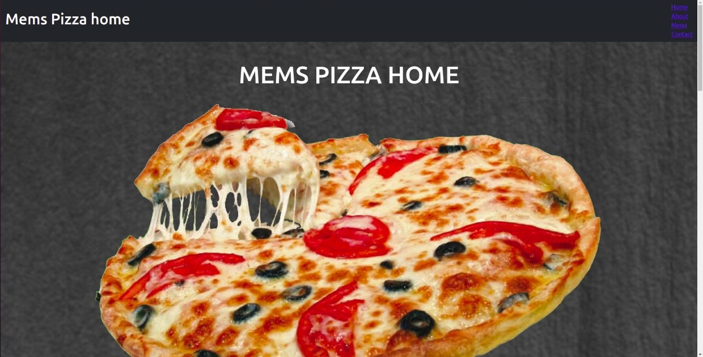
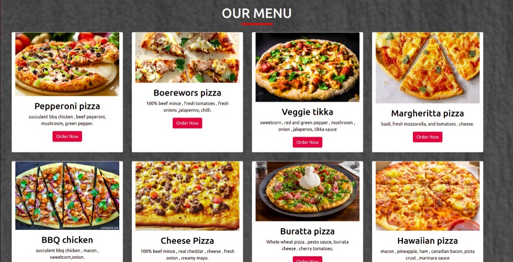
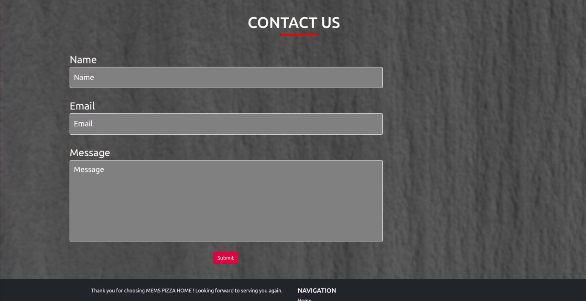

# Mems pizza home
 Mems pizza home is a site for ordering pizza online and have it delivered at your home.

## Live site 
https://memory-wabwile.github.io/delani-studio/

## Author 
Wabwile Memory
https://github.com/Memory-Wabwile

## Description
 Mems Pizza home is a site for ordering pizza online and choosing whether you want the pizza to be delivered or not. after ordering you get a total amount of your orders.

## Design
Landing page design for Mems pizza home

 

## Setup/Installation Requirements
* click on https://github.com/Memory-Wabwile/delani-studio.git to clone this repository.
* application runs on all browsers
* This application can run on any software , android , MacOs or windows. it only needs installation which can be done from playstore appstore or any browser

## Known Bugs
currently there are no identified bugs of the system 

## Technologies Used
1.Html - for the front end design 
2.Css - for styling the page 
3.Javascript - for adding functionality 
4.Bootstrap - for responsiveness 
5.Jquery - for functionality 

## Behaviour Driven Development
<ul>
<li>Click order now on the pizza you want.</li> 
<li>It will direct you to another page where you enter specifications of what you want on the pizza.<li> 
<li>Click on place an order to finish the order ad checkout</li> 
</ul><r>

## Contributions
contributors are welcome.. click on  https://github.com/Memory-Wabwile/Mems-Pizza-home.git and make a pull request then commit the changes

## Support and contact details
Contact me at memorywabwile@gmail.com for any querries or inquiries.

### License
Copyright (c) {2021} *{Wabwile Memory}*

Permission is hereby granted, free of charge, to any person obtaining a copy
of this software and associated documentation files (the "Software"), to deal
in the Software without restriction, including without limitation the rights
to use, copy, modify, merge, publish, distribute, sublicense, and/or sell
copies of the Software, and to permit persons to whom the Software is
furnished to do so, subject to the following conditions:

The above copyright notice and this permission notice shall be included in all
copies or substantial portions of the Software.

THE SOFTWARE IS PROVIDED "AS IS", WITHOUT WARRANTY OF ANY KIND, EXPRESS OR
IMPLIED, INCLUDING BUT NOT LIMITED TO THE WARRANTIES OF MERCHANTABILITY,
FITNESS FOR A PARTICULAR PURPOSE AND NONINFRINGEMENT. IN NO EVENT SHALL THE
AUTHORS OR COPYRIGHT HOLDERS BE LIABLE FOR ANY CLAIM, DAMAGES OR OTHER
LIABILITY, WHETHER IN AN ACTION OF CONTRACT, TORT OR OTHERWISE, ARISING FROM,
OUT OF OR IN CONNECTION WITH THE SOFTWARE OR THE USE OR OTHER DEALINGS IN THE
SOFTWARE.)

